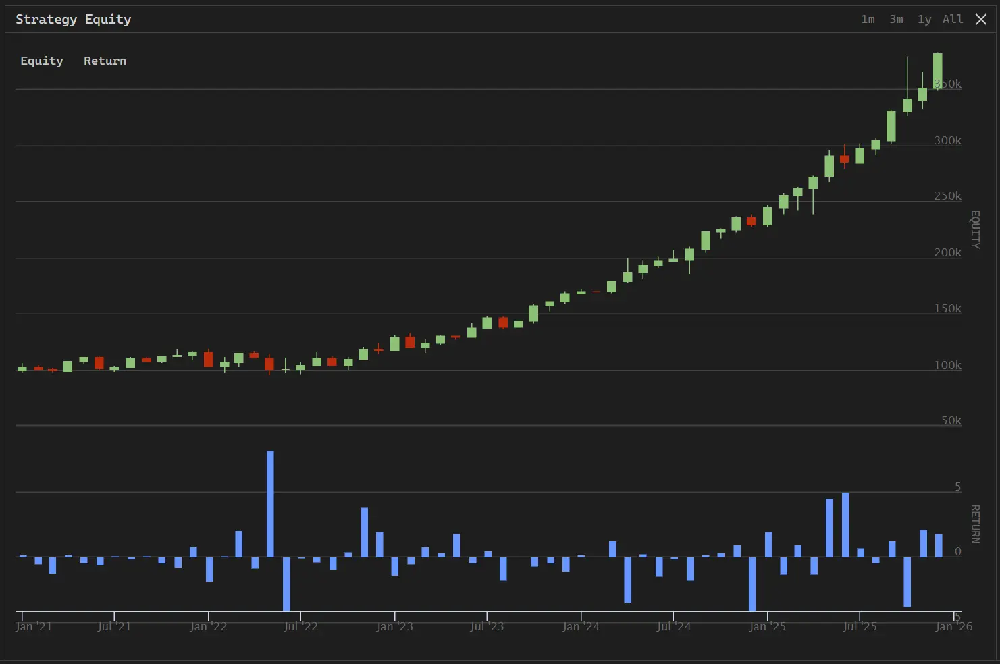
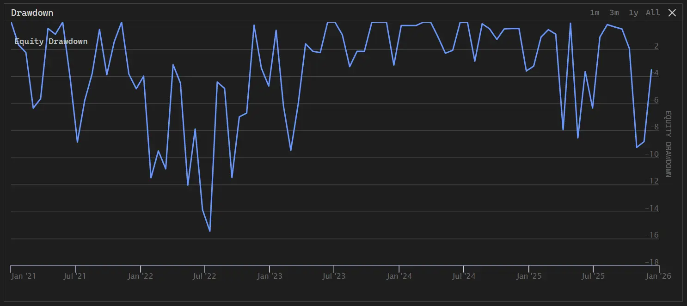
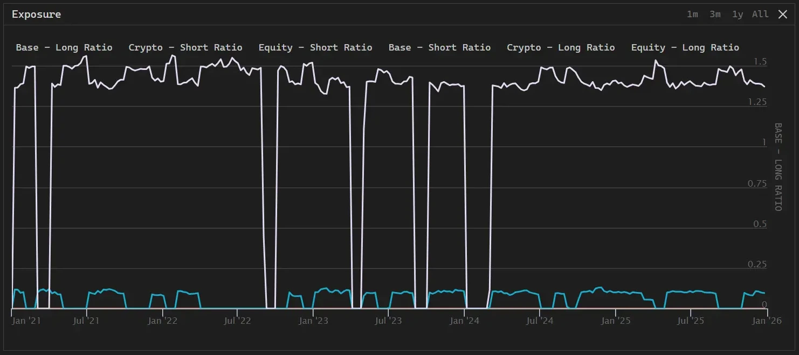
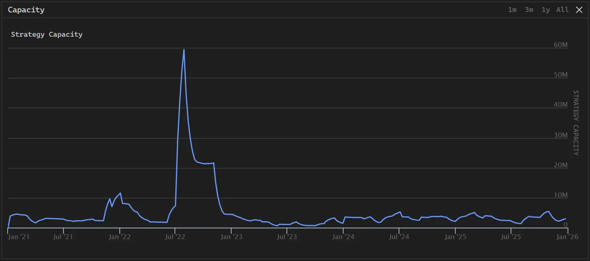
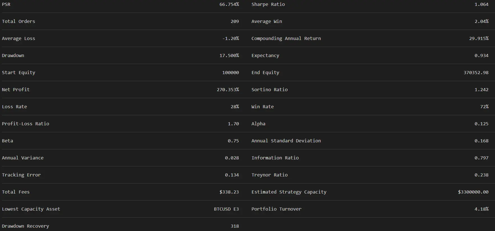

# Cross Asset Macro Factor Strategy

This strategy uses a DecisionTreeRegressor model to predict future returns for various assets based on macro-economic factors, adjusting portfolio weights accordingly.

## Core Assets and Factor Inputs

The strategy builds a cross-asset pool and incorporates external macro data as predictive features:

- Investment Targets: Includes the S&P 500 Index (SPY), Gold (GLD), Aggregate Bond Market (BND), and Bitcoin (BTCUSD).
- Macro Factors (FRED): Utilizes the VIX Volatility Index (VIXCLS), the 10-Year minus 3-Month Treasury yield spread (T10Y3M), and the Effective Federal Funds Rate (DFF). These factors are typically used to measure market volatility, economic recession expectations, and the monetary policy environment.

## Machine Learning Model Construction

The core of the strategy lies in predicting future asset performance using historical factor data:

- Feature Engineering: FRED macro factors are used as input features (X) and standardized via StandardScaler to eliminate scaling differences.
- Labeling: The 21-day forward total return (approximately one month) is calculated as the prediction target (y).
- Model Training: The decision tree model is retrained at the start of each month. It trains separate models for each asset, using the past 4 years of historical data to identify non-linear relationships between macro factors and returns.

## Prediction and Weight Allocation

In each rebalancing cycle, the strategy generates predictions based on the latest factor values:

- Positive Screening: Assets are only included in the portfolio if their predicted return is positive.
- Leverage Management: Initial weights are allocated proportionally based on the magnitude of the positive predicted returns, with a total gross leverage of 1.5x applied.
- Bitcoin Risk Control: Due to the high volatility of cryptocurrencies, a maximum weight cap is set for Bitcoin (defaulting to 10%). If predictions suggest a larger allocation, the excess weight is redistributed proportionally among traditional assets like SPY, GLD, and BND.

## Trade Execution Logic

- Rebalance Frequency: Executed once per month.
- Automated Adjustment: Uses the set_holdings function to adjust holdings to target proportions via PortfolioTarget objects, automatically handling buy and sell logic.

```python
# Example: Initialization configuration for the DecisionTreeRegressor
self._model = DecisionTreeRegressor(max_depth=12, random_state=1)
```

This configuration balances the model's capture capability and overfitting risk by limiting the maximum tree depth to 12.

## Backtest Results











## Optimization Directions

- Decision tree max_depth
- Use different machine learning models such as Random Forest
- Factor selection
